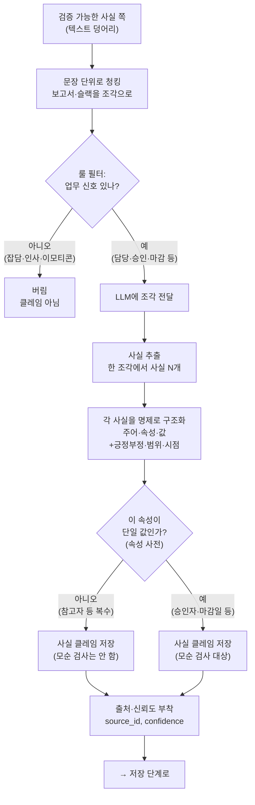
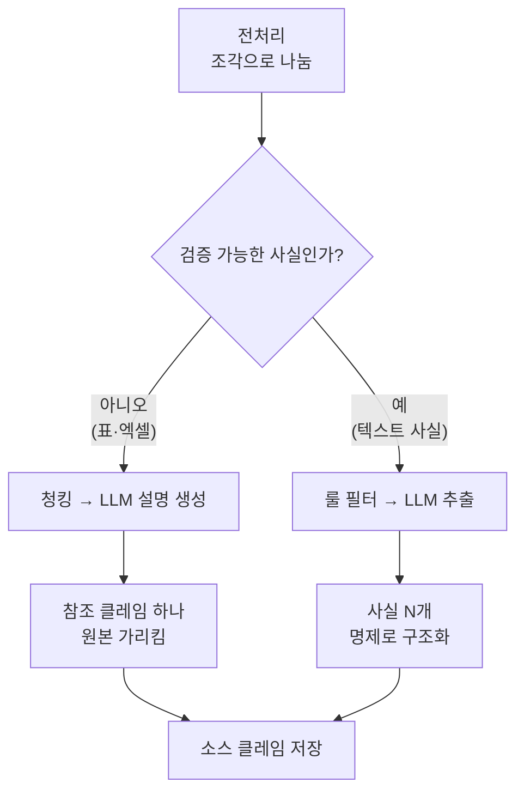
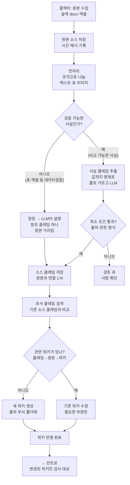
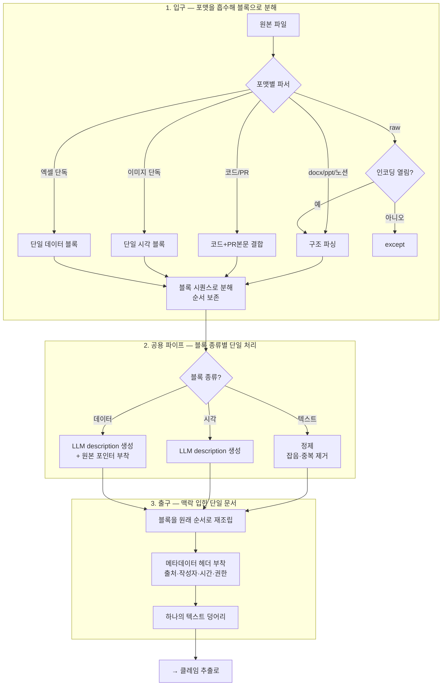

두 가지를 정리하겠습니다. 먼저 용어 문제부터 풀고, 그 다음 단일 사실 쪽 로직을 자세히 그리겠습니다.

**용어 — 혼동의 원인을 짚으면**

"단일 사실"이 헷갈리는 이유가 명확합니다. **보고서 하나에서 사실이 여러 개 나오는데 "단일"이라고 부르니까** 모순처럼 들립니다. "단일"이 무엇을 수식하는지가 흐려서 그렇습니다.

정확히는 "사실 하나하나가 단일 값을 가진다"는 뜻인데, 이게 "사실이 하나만 나온다"로 오해됩니다. 그러니 **"단일"을 떼고** 부르는 게 낫습니다. 대안을 드리면:

```
자료 묶음 쪽 →  "데이터집합" (본인이 쓰신 것, 좋음)
                또는 "참조 자료" / "원본 참조"

단일 사실 쪽 →  "검증 가능 사실" 또는 그냥 "사실"
                또는 "명제형 사실"
```

"단일 사실" 대신 **"검증 가능 사실"** 또는 줄여서 **"사실"**을 권합니다. 핵심이 "비교해서 맞고 틀림을 따질 수 있다"는 거니까요. 보고서에서 이런 사실이 여러 개 나와도 "검증 가능 사실들"이라고 하면 모순이 안 생깁니다.

그래서 분기를 이렇게 부르면 깔끔합니다.

```
"검증 가능한 사실인가?"
  예    → 사실 클레임 (값까지 명제로)
  아니오 → 참조 클레임 (원본 가리킴, 데이터집합)
```

**데이터집합 쪽 로직 (본인 정리가 맞음, 확인)**

엑셀·표 같은 데이터집합은 이렇게 흐릅니다.

```
표/엑셀 감지
  → 청킹 (표를 LLM이 읽을 단위로 자름)
  → LLM이 읽고 "이게 무슨 자료인지" 설명 생성
  → 참조 클레임 하나만 생성 (값은 원본에, 클레임은 원본을 가리킴)
```

본인이 정리하신 그대로입니다. 내용을 쪼개 클레임 여러 개를 만드는 게 아니라, **자료 전체를 설명하는 클레임 하나**만 만들고 원본을 가리킵니다.

**사실 쪽 로직 — 자세히**

이쪽이 더 복잡합니다. 보고서 같은 텍스트 덩어리에서 사실을 여러 개 뽑아야 하니까요. 단계를 풀어 그리겠습니다.



이 흐름의 핵심 단계를 짚어드립니다.

**문장 단위 청킹** — 보고서 하나가 통째로 LLM에 가는 게 아니라, 문장·문단 조각으로 나뉩니다. 그래야 "한 조각에서 사실 몇 개"를 깔끔하게 뽑습니다. 보고서에서 사실이 여러 개 나오는 게 자연스러워지는 지점입니다.

**룰 필터** — LLM에 넣기 전에 잡음을 거릅니다. "ㅋㅋㅋ", "넵", 인사말은 업무 신호(담당·승인·마감·배포 같은 키워드)가 없으니 버립니다. LLM 호출을 줄이는 단계입니다.

**사실 추출 (한 조각 → N개)** — 살아남은 조각에서 LLM이 사실을 뽑습니다. "경비는 박지현이 승인하고 마감은 25일"이라는 한 문장에서 사실 두 개가 나옵니다. 여기서 "보고서 하나 = 사실 여러 개"가 실현됩니다.

**명제로 구조화** — 뽑은 사실을 주어/속성/값 + 긍정부정/범위/시점으로 만듭니다.

**속성 사전 분기** — 이 사실의 속성이 단일 값인지 복수 값인지 봅니다. 승인자는 단일(다르면 모순), 참고자는 복수(달라도 모순 아님). 둘 다 저장하지만, 단일 값만 나중에 모순 검사 대상이 됩니다.

**두 쪽을 합친 전체 모습**

방금 두 로직을 원래 인제스트 차트의 분기에 끼우면 이렇게 됩니다.



왼쪽이 데이터집합(참조 클레임 하나), 오른쪽이 검증 가능 사실(사실 클레임 여러 개)입니다. 분기 이후 둘 다 결국 소스 클레임으로 저장되는 건 같습니다.

---

정리하면 이렇습니다.

**용어**: "단일 사실"이 "사실 하나만 나온다"로 오해되니, **"검증 가능 사실"** 또는 그냥 **"사실"**로 바꾸세요. 분기 질문도 "값이 하나로 정해지나?"보다 **"검증 가능한 사실인가?"**가 한 번에 와닿습니다. 데이터집합 쪽은 본인이 쓰신 "데이터집합" 또는 "참조 클레임"이 좋습니다.

**데이터집합 로직**: 표/엑셀을 청킹해 LLM이 읽고, 자료 전체를 설명하는 **참조 클레임 하나**만 만들어 원본을 가리킵니다. 본인 정리가 맞습니다.

**사실 로직**: 텍스트를 문장 조각으로 나누고 → 룰로 잡음 거르고 → LLM이 한 조각에서 사실 N개를 뽑고 → 각각을 명제로 구조화하고 → 속성 사전으로 단일/복수를 가른 뒤 → 출처를 붙여 저장합니다. "보고서 하나에서 사실 여러 개"는 청킹과 추출 단계에서 자연스럽게 나옵니다.

핵심 차이를 한 줄로 하면, 데이터집합은 **자료를 통째로 가리키는 클레임 하나**, 검증 가능 사실은 **조각마다 뽑아내는 클레임 여러 개**입니다. 전자는 내용을 안 따지고 가리키기만 하고, 후자는 내용을 명제로 만들어 나중에 모순 검사에 씁니다.


분기 처리 부분만 손보겠습니다. 두 군데를 바꿉니다.

**바꾸는 곳**

1. **"값이 하나로 정해지나?"** → 모호하니 **"검증 가능한 사실인가?"**로. 갈래 이름도 "사실 클레임 / 참조 클레임"으로 명확히.
2. **"분류 꼬리표 부착"** → 트리 저장으로 정했으니 꼬리표는 빠지고, **"출처 부서 폴더에 생성"**으로.

나머지(최소 조건 통과, 관련 위키 있나)는 그대로 둡니다.



바뀐 분기를 짚어드립니다.

**"검증 가능한 사실인가?"** — 기존 "값이 하나로 정해지나"를 바꿨습니다. 비교해서 맞고 틀림을 따질 수 있는 사실이면 "예", 표·엑셀처럼 쌓아두고 참조하는 자료면 "아니오"입니다. 갈래도 "사실 클레임"과 "참조 클레임"으로 이름을 줘서, 처음 보는 사람도 무엇이 갈라지는지 바로 압니다.

**"아니오" 쪽** — 데이터집합은 청킹해서 LLM이 설명을 만들고, 그 자료를 가리키는 참조 클레임 하나만 생성합니다. 값은 원본 파일에 있습니다.

**"새 위키 생성 — 출처 부서 폴더에"** — 꼬리표를 뺐습니다. 트리로 저장하기로 했으니, 새 위키는 출처 부서 폴더 안에 만듭니다. 앞서 정한 귀속 규칙(원본 소스의 출처 부서로)이 여기서 폴더 위치를 정합니다.

두 가지만 더 짚어두겠습니다.

전처리 단계 문구를 "조각으로 나눔"으로 살짝 바꿨습니다. 분기가 파일 통째가 아니라 내용 조각마다 도는 거라, 전처리에서 텍스트·표·이미지로 나눈다는 게 드러나야 그 다음 분기가 자연스럽기 때문입니다.

속성 사전(단일/복수) 분기는 이 인제스트 차트에 일부러 안 넣었습니다. 앞서 말했듯 단일/복수 판단은 모순 검사(린트) 때 꺼내 쓰는 거라, 인제스트에서는 그냥 저장하면 됩니다. 인제스트에 넣으면 차트만 복잡해지고 실익이 없습니다.


___

좋습니다. 우리 합의에 얽매이지 않고, 제가 생각하는 가장 깔끔한 전처리 설계를 말씀드리겠습니다. 핵심 원칙부터 세우고, 그 원칙으로 전체를 다시 짜겠습니다.

**먼저 — 전처리를 관통하는 단 하나의 원칙**

여러 소스, 여러 데이터 타입이 들어오지만, 잘 만든 전처리는 **분기를 최대한 늦게, 최소한으로** 둡니다. 입구에서 종류별로 다 갈라버리면 경로가 수십 개로 터지고 유지가 안 됩니다. 그래서 제가 세우는 원칙은 이겁니다.

> **소스와 포맷은 입구에서 흡수하고, 가운데는 모두가 공유하는 단일 파이프라인으로 만든다.**

구체적으로, 모든 입력을 **세 가지 기본 요소**로 환원합니다. 어떤 소스에서 왔든, 어떤 포맷이든, 결국 이 셋 중 하나입니다.

```
텍스트 블록   — 글. 그대로 의미가 있음
시각 블록     — 이미지·차트 그림. description으로 텍스트화 필요
데이터 블록   — 표·스프레드시트. description + 원본 보관
```

docx든 ppt든 노션이든, 안을 뜯으면 이 세 종류 블록의 나열입니다. 그러면 "포맷마다 다른 처리"가 아니라 "블록 종류마다 다른 처리" 세 개로 줄어듭니다. 포맷은 수십 개여도 블록은 세 개입니다.

**왜 이게 더 나은가**

본인들이 짠 방식은 포맷별로 경로를 그렸습니다(docs는 이렇게, ppt는 저렇게, raw는 또…). 그런데 자세히 보면 docs도 ppt도 노션도 하는 일이 같습니다. **텍스트 뜯고, 이미지 만나면 description 넣고, 표 만나면 description 넣고.** 같은 일을 포맷마다 반복해서 적은 겁니다.

블록으로 환원하면 이 반복이 사라집니다. "텍스트 블록은 이렇게, 시각 블록은 이렇게, 데이터 블록은 이렇게"를 한 번만 정의하고, 모든 포맷이 그걸 공유합니다.

**3단계 구조 — 입구, 공용 파이프, 출구**



각 단계에서 제가 중요하게 본 결정들을 짚겠습니다.

**입구 — 파서는 "분해"만 하고 "이해"는 안 한다**

입구의 포맷별 파서는 딱 한 가지만 합니다. 파일을 열어 **순서를 가진 블록 시퀀스로 쪼개는 것.** 내용을 해석하지 않습니다. docx 파서는 "1번 텍스트, 2번 이미지, 3번 텍스트, 4번 표" 이렇게 순서만 뽑습니다. 여기서 LLM을 쓰지 않습니다. 이게 중요합니다. 입구가 무거우면 포맷 추가할 때마다 고생합니다.

여기서 본인들과 갈리는 지점이 하나 있습니다. 본인들은 raw 파일을 "인코딩 열어 문서면 docs처럼"이라고 했는데, 저는 **모든 포맷을 이 블록 분해기 앞에 세웁니다.** raw만 특별 취급하지 않고, "이 파일을 블록으로 쪼갤 수 있나?"를 모두에게 똑같이 묻습니다. 쪼개지면 진행, 안 쪼개지면 except. raw가 예외가 아니라, 모든 포맷이 같은 관문을 통과합니다.

**공용 파이프 — 여기가 핵심, 블록 종류는 셋뿐**

분해된 블록은 종류에 따라 셋 중 하나로 갑니다. 포맷이 뭐였는지는 여기서 잊습니다. docx에서 나온 이미지 블록이든 노션에서 나온 이미지 블록이든, **똑같은 "시각 블록 처리"를 탑니다.** 이게 반복을 없애는 지점입니다.

- 텍스트 블록 → 정제(잡음·중복 제거)
- 시각 블록 → LLM이 description 생성
- 데이터 블록 → LLM이 description 생성 + 원본 위치 포인터 부착

데이터 블록만 포인터를 추가로 답니다. 나중에 정확한 수치가 필요할 때 원본으로 돌아가야 하니까요.

**출구 — 순서대로 재조립하고 맥락을 입힌다**

처리된 블록들을 **원래 순서대로** 다시 꿰맵니다. 순서가 핵심입니다. "이 표 다음에 이 설명이 있었다"는 배치 자체가 맥락이니까요. 그래서 입구에서 순서를 보존한 게 여기서 쓰입니다.

마지막으로, 제가 본인들 설계에 **추가하고 싶은 한 가지**가 여기 있습니다. 재조립한 텍스트 맨 앞에 **메타데이터 헤더**를 답니다.

```
[출처: 재무팀 공유드라이브 / 작성자: 박지현 / 작성일: 2026-06-10 / 권한: 재무팀]

(본문 텍스트 덩어리...)
```

왜냐하면 의미·맥락을 가진 문서가 되려면 본문만으로는 부족합니다. **"이게 누구의, 언제, 어느 부서 자료인가"**가 맥락의 절반입니다. 같은 "승인자는 박지현"이라도 재무팀 6월 자료인지 개발팀 3월 자료인지에 따라 의미가 다릅니다. 이 헤더가 나중에 클레임의 scope·time_scope·source를 채우는 재료가 되고, 위키 귀속 폴더를 정하는 근거도 됩니다. 본인들 흐름엔 이게 명시 안 돼 있었는데, 전처리 출구에서 박아두면 뒤가 다 편해집니다.

**본인들 설계와 비교하면 — 무엇이 달라졌나**

```
본인들:  포맷마다 경로를 그림 (docs는…, ppt는…, raw는…)
         → 같은 일을 여러 번 적게 됨

제 안:   포맷은 입구에서 블록으로 분해 → 가운데는 블록 3종 단일 처리
         → 같은 일을 한 번만 정의, 모든 포맷이 공유
```

결과물(하나의 텍스트 덩어리)은 같습니다. 차이는 **유지보수와 확장**입니다. 본인들 방식은 새 포맷(예: HWP, PDF)이 들어오면 새 경로를 통째로 그려야 합니다. 제 방식은 새 포맷의 **블록 분해기만** 입구에 하나 추가하면, 가운데 파이프는 그대로 씁니다. PDF가 들어와도 "PDF를 블록으로 쪼개는 법"만 만들면, 그 안의 텍스트·이미지·표는 기존 처리를 탑니다.

---

정리하면, 제가 생각하는 가장 깔끔한 전처리는 **"포맷은 입구에서 흡수하고, 가운데는 블록 3종(텍스트·시각·데이터)의 단일 파이프라인으로 만드는 것"**입니다.

세 단계입니다. **입구**에서 포맷별 파서가 파일을 순서 가진 블록 시퀀스로 분해하되 해석은 안 합니다(LLM 안 씀). **공용 파이프**에서 블록 종류별로 처리합니다. 텍스트는 정제, 시각·데이터는 LLM으로 description 생성, 데이터는 원본 포인터 추가. **출구**에서 블록을 원래 순서로 재조립하고, 출처·작성자·시간·권한 메타데이터 헤더를 앞에 답니다.

본인들 설계와 결과물은 같지만, 포맷별로 경로를 그리는 대신 블록으로 환원해 반복을 없앴습니다. 그래서 새 포맷이 들어와도 블록 분해기만 추가하면 가운데는 그대로 씁니다.

	제가 추가한 핵심 두 가지는 ① 모든 포맷을 똑같은 "블록으로 쪼갤 수 있나" 관문에 세운 것(raw만 특별 취급 안 함), ② 출구에서 메타데이터 헤더를 박아 본문에 맥락을 입힌 것입니다. 특히 메타데이터 헤더는 본인들 흐름에 없었는데, 이게 클레임의 scope·출처·귀속 폴더를 정하는 재료가 되니 꼭 넣으시길 권합니다.